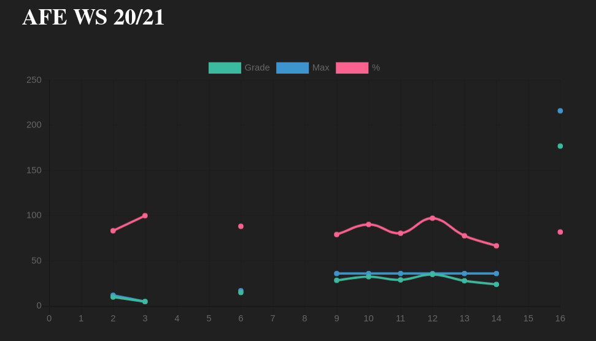

# Moodle Grades

Fetch Moodle grades from your server and display them as line charts

## Quick Start

1. Grab your token from your Moodle page.
It can be found under "Dashboard" > "Preferences" > "User account" > "Security keys".
The one you are looking for is "Moodle mobile web service".
Place that and your universities domain in `.env`.

2. `npm run dev`

3. Browse `http://localhost:3000`
